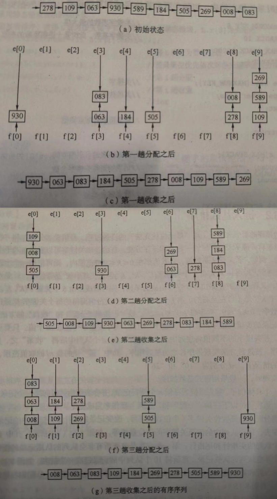
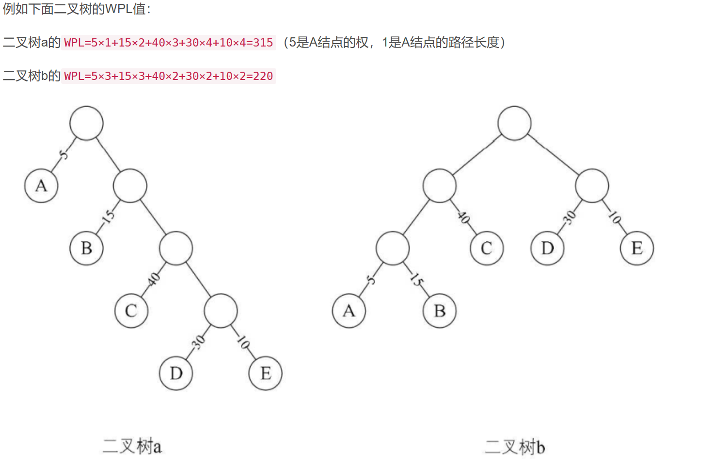
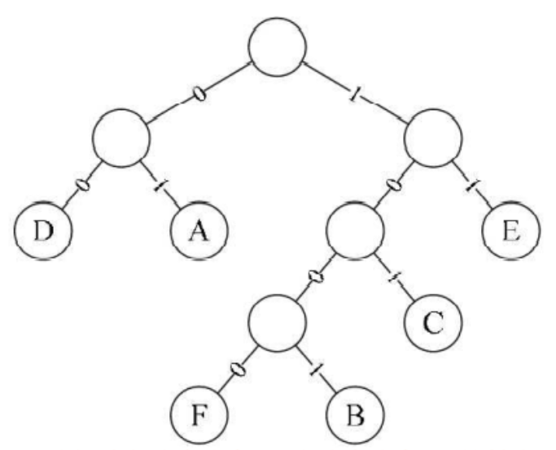

# C++学习中遇到的问题

从23年春开始，系统的学习c++，阅读c++ primer，阅读effective c++，STL源码剖析等书籍，将一些C++相关问题记录在这里

# 语法篇

## 内存划分

1. 栈区（Stack）

栈区是由编译器自动管理的内存区域，用于存储函数调用时的参数、局部变量、返回值等信息。栈区的特点是空间有限，大小受到系统限制，一般几 M 到几十 M 不等。栈区的分配和释放是自动进行的，随着函数的调用和返回而动态变化。

​	2.堆区（Heap）

堆区是由程序员手动管理的内存区域，用于存储动态分配的内存。堆区的特点是空间比栈区大，可以动态分配和释放内存，但需要程序员手动管理。堆区的分配和释放需要使用相应的函数（如 `new` 和 `delete`），需要注意内存泄漏和指针悬挂等问题。

​	3.全局区（Static）

全局区是用于存储全局变量和静态变量的内存区域，程序启动时就已经分配好了。全局变量和静态变量存储在程序的数据段中，占用的内存大小由变量类型和个数决定，大小固定不变。

​	4.常量区（Constant）

常量区是用于存储常量字符串和全局常量的内存区域，程序启动时就已经分配好了。常量区的特点是只读，不允许修改。

​	5.代码区（Code）

代码区是用于存储程序的指令代码的内存区域，也称为文本区。代码区是只读的，程序无法修改代码区的内容。

需要注意的是，以上内存分区只是一种抽象的概念，具体实现可能因系统和编译器的不同而有所不同。例如，常量区和代码区可能会合并成一个只读的内存区域。


在理解C/C++内存分区时，常会碰到如下术语：数据区，堆，栈，静态存储区，静态区，常量区，常变量区，全局区，字符串常量区，静态常量区，静态变量区，文字常量区，代码区等等，初学者被搞得云里雾里。在这里，尝试捋清楚以上分区的关系。

**数据区包括**：堆，栈，全局/静态存储区。

**全局/静态存储区包括**：常量区（静态常量区），全局区（全局变量区）和静态变量区（静态区）。

**常量区包括**：字符串常量区和常变量区。

**代码区**：存放程序编译后的二进制代码，不可寻址区。

**可以说，C/C++内存分区其实只有两个，即代码区和数据区。** 

## 内存对齐

```
class A
{
    public:
        char a;
        int b;
};

class B:A
{
    public:
        short a;
        long b;
}
```

按照$C++$标准规范，$sizeof(B)$的结果应该是24（8+8+8），但是某些编译器的结果是16，这是由于编译器采用的内存对齐方式并不是默认方式，而是紧凑的内存布局，在这个策略下，如果在$B$中再加一个 $int\ c$ ，$sizeof(B)$ 为20，而默认对齐方式仍然为24  

对于内存对齐方式的选择，通常需要在代码的效率和可移植性之间进行权衡。

对于效率来说，采用紧凑的内存布局和对齐方式可以减少数据存储和访问的开销，从而提高程序的性能。

对于可移植性来说，应该尽可能地遵守 C++ 标准规范，使用标准的内存对齐方式，以确保代码可以在不同的平台上正确地运行。

为了同时兼顾效率和可移植性，可以在需要时使用编译器提供的特定选项来控制内存对齐方式。例如，在 $GCC$ 中，可以使用 `-fpack-struct` 选项来指定结构体成员的对齐方式。如果不指定对齐方式，则默认采用编译器的默认对齐方式。

## 指针大小

C++中指针大小只和操作系统的地址长度有关（16，32，64或其他），不要误认为指针大小就是 $int$ 的大小（虽然大多数时候是这样）。`int` 的大小固定为4字节，在将指针转换为 `int` 类型时，需要使用正确的大小进行转换，否则可能会截断指针地址或者访问错误的内存地址。

## 析构函数作为虚函数

构造函数不能成为虚函数，因为虚函数有在类里面实际上是一个虚函数指针，而虚函数指针只有在初始化之后才能得到，初始化必须调用构造函数，而此时构造函数又未被定义（虚函数指针未被指定)

析构函数常常作为虚函数使用，在子类对象回收之后，希望被引用的父类执行一些操作，比如释放资源，此时就可以通过虚函数的析构函数完成操作。

## C++与C编译区别

在C++中常在头文件见到extern "C"修饰函数，那有什么作用呢？ 是用于C++链接在C语言模块中定义的函数。

C++虽然兼容C，但C++文件中函数编译后生成的符号与C语言生成的不同。因为C++支持函数重载，C++函数编译后生成的符号带有函数参数类型的信息，而C则没有。

例如`int add(int a, int b)`函数经过C++编译器生成.o文件后，`add`会变成形如`add_int_int`之类的, 而C的话则会是形如`_add`, 就是说：相同的函数，在C和C++中，编译后生成的符号不同。

这就导致一个问题：如果C++中使用C语言实现的函数，在编译链接的时候，会出错，提示找不到对应的符号。此时`extern "C"`就起作用了：告诉链接器去寻找`_add`这类的C语言符号，而不是经过C++修饰的符号。

## static_cast 

一种较为安全的类型转换，在编译阶段给出错误

[static_cast与传统的C风格强制类型转换_](https://blog.csdn.net/qq_28127741/article/details/120615000?ops_request_misc=%7B%22request%5Fid%22%3A%22168085506016800180685640%22%2C%22scm%22%3A%2220140713.130102334..%22%7D&request_id=168085506016800180685640&biz_id=0&utm_medium=distribute.pc_search_result.none-task-blog-2~all~sobaiduend~default-1-120615000-null-null.142^v82^insert_down38,201^v4^add_ask,239^v2^insert_chatgpt&utm_term=static_cast和强制转换的区别&spm=1018.2226.3001.4187) 

## 左值右值将亡值

我也不清楚，弄清楚之后再补充

通过这篇文章引入 [decltype](C:\Users\20836\Desktop\我是文件夹\compiler\CPlusPlusThingsPlus\basic_content\decltype) 

[值类型](https://zh.cppreference.com/w/cpp/language/value_category)

## *_cast

[C++的四种cast操作符的区别--类型转换 - Welfare - 博客园 (cnblogs.com)](https://www.cnblogs.com/welfare/articles/336091.html) 

## 派生类对象的构造

- 先构造基类
- 再构造成员
- 最后构造自身（调用构造函数）

基类构造顺序由派生层次决定：**最远的基类最先构造**
成员构造顺序和定义顺序符合
析构函数的析构顺序与构造相反

说出以下代码的输出结果就算通关：

```cpp
#include <iostream>
using namespace std;
class A {
    int x;
public:
     A(int i=0) {x=i; cout << "A-----"<<x<<endl; }
};
class B {
    int y;
public:
    B(int i) { y=i; cout << "B-----"<<y<<endl; } 
}; 
class C {
    int z;
public:
    C(int i) {z=i; cout << "C-----"<<z<<endl; } 
};
class D : public B{
public: 
    C c1, c2;
    A *a1 = new A(10);
    B b0(1);
    A a0,a4;
    D( ) : a4(4),c2(2),c1(1),B(1) {
		cout << "D-----5"<<endl;
    }
};
int main(){
    D d;
    system("pause");
}
```

## 虚函数和虚拟继承

这里的关系总是一种很凌乱的感觉，写在这里是希望能去多看些资料加深理解和巩固

基类对象（或基类对象的指针或引用）访问到派生类对象从基类中继承到的成员， 不能借此访问派生类定义的成员。

## tuple

[C++ tuple_c++ tuple 比较_叶光纪的博客-CSDN博客](https://blog.csdn.net/qq_43982833/article/details/112427618?ops_request_misc=%7B%22request%5Fid%22%3A%22168145451016800188556097%22%2C%22scm%22%3A%2220140713.130102334.pc%5Fall.%22%7D&request_id=168145451016800188556097&biz_id=0&utm_medium=distribute.pc_search_result.none-task-blog-2~all~first_rank_ecpm_v1~rank_v31_ecpm-1-112427618-null-null.142^v83^insert_down38,239^v2^insert_chatgpt&utm_term=C%2B%2Btuple&spm=1018.2226.3001.4187) 

```cpp
#include <iostream>
#include <tuple>
#include <bitset>

using namespace std;

//泛化版，打印IDX下标的元素
template<int IDX,int MAX,typename... Args>
struct print_tuple{
    static void print(ostream &os,const tuple<Args...>& t){
        os << get<IDX>(t) << (IDX +1 == MAX ? "":",");
        print_tuple<IDX+1,MAX,Args...>::print(os,t);
    }
};

//这是特化版，当且仅当IDX==MAX时候会调用这个特化版本
template<int MAX,typename... Args>
struct print_tuple<MAX,MAX,Args...>{
    static void print(ostream &os,const tuple<Args...>& t){}
};

template<typename... Args>
ostream& operator<< (ostream& os,const tuple<Args...>& args)
{
    os<<"[";
    print_tuple<0,sizeof...(Args),Args...>::print(os,args);
    return os<<"]";
}

int main()
{
    cout << make_tuple(7.5, string("hello"), bitset<16>(377), 47) << endl;
    return 0;
}
```

还有一种递归继承方式的：

```cpp
//
// Created by light on 19-11-4.
//

#include <iostream>


using namespace std;
// 上一个例子:variadic5.cpp为递归调用
// 当前这个例子为递归继承
namespace light {
    template<typename...Values>
    class tuple;

    template<>
    class tuple<> {
    };

    template<typename Head, typename...Tail>
    class tuple<Head, Tail...> : private tuple<Tail...> {
        typedef tuple<Tail...> inherited;
    protected:
        Head m_head;
    public:
        tuple() {}

        tuple(Head h, Tail...tail) : m_head(h), inherited(tail...) {}

        // decltype()中的m_head必须放到前面,否则编译器找不到
        auto head() -> decltype(m_head) { return m_head; }
        // 或者 Head head()  { return m_head; }

        inherited &tail() { return *this; }
    };
}
/**
 * string 32   8字节对齐
 * float  4
 * int    4
 * 4+4+32=40 自底向上
 */

int main() {
    using light::tuple;
    tuple<int, float, string> t(41, 6.3, "nico");
    cout << sizeof(t) << endl;
    cout << t.head() << endl;
    cout << t.tail().head() << endl;
    cout << t.tail().tail().head() << endl;

    return 0;
}

```

## 右值引用

[深入理解C++右值引用 - 可可西 - 博客园 (cnblogs.com)](https://www.cnblogs.com/kekec/p/10810507.html) 

## lambda表达式

这个东西似乎很复杂，引入lambda表达式的好处之一是降低函数调用的开销，lambda表达式是一个轻量级函数对象，可以像函数一样执行操作，但不会有函数一样的堆栈调用，创建对象等开销。

基础用法就是像 $ [introducer](optional)mutable throwSpec->retType {} $ 这样子定义一个表达式返回值什么的，各个参数的含义和基础用法网上有很优秀的博客参考：

lambda最能体现强大之处的应该是和标准库的"交互"了，以STL标准库为例：

```
vec.erase(remove_if(vec.begin(), vec.end(), [x, y](int n) { return x < n && n < y; }), vec.end());
for_each(vec.begin(), vec.end(), [](int i) { cout << i << " "; });
    
```

[C++11：lambda表达式_sponge'的博客-CSDN博客](https://blog.csdn.net/zhang_si_hang/article/details/127117260) 


## 栈解退

栈解退发生的条件是在函数执行期间抛出了异常并且该异常未被当前函数处理。当发生异常时，程序会在当前函数中创建一个异常对象，然后将当前函数中的所有局部变量和参数从栈中弹出，并将控制权转移到调用该函数的上一级函数中的 `catch` 块。这个过程就是栈解退。

在栈解退过程中，当程序执行到某个函数时出现异常，该函数会立即停止执行，并且当前函数中的所有局部变量和参数都会被销毁。然后，程序会将控制权转移给该函数的调用方，并在调用方中查找匹配的 `catch` 块来处理异常。如果没有找到匹配的 `catch` 块，则异常会继续向上层函数传递，直到找到匹配的 `catch` 块或者到达程序的顶层函数。

栈解退是一种异常处理机制，它可以让程序在出现异常时进行适当的处理，避免程序崩溃或者出现未定义行为。在编写程序时，我们应该考虑异常处理机制，尽可能地捕获和处理异常，以确保程序的健壮性和可靠性


## typename

`typename`除了写模板的时候用来当参数类型外，还用于表示某个依赖类型名称是一个类型。

```c
template <typename T>
class MyClass {
public:
    typedef T value_type;
    value_type* ptr;
};
```

如果要使用这个`value_type`类型去定义变量，由于`value_type`是一个依赖类型名称，因此需要使用`typename`关键字来明确告诉编译器它是一个类型，即:

```
typename MyClass<int>::value_type obj;
```

更复杂的情况：

```c
template<typename T, typename Alloc = std::allocator<T>>
class MyList {
public:
    typedef typename Alloc::template rebind<T>::other allocator_type;
    // ...
};
```

`allocator_type`是一个内嵌类型，它依赖于类模板的第二个模板参数`Alloc`。由于`Alloc::template rebind<T>::other`是一个依赖名称，因此需要使用`typename`关键字来明确告诉编译器它是一个类型。


## 操作符重载


| Expression | As member function   | As non-member function |
| ---------- | -------------------- | ---------------------- |
| @a         | (a).operator@ ()     | operator@ (a)          |
| a@b        | (a).operator@ (b)    | operator@ (a, b)       |
| a=b        | (a).operator= (b)    | cannot be non-member   |
| a[b]       | (a).operatorp\[] (b) | cannot be non-member   |
| a->        | (a).operator-> ()    | cannot be non-member   |
| a@         | (a).operator@ (0)    | operator@ (a, 0)       |


## C式字符串

```cpp
int main()
{
    char str[] = "hello"; // str是数组，可以修改
    str[1] = 'a';
    cout << str << endl; // hallo

    char *p = "12346";
    // func(p); // p是常量字符串，不能修改
    cout << p << endl; // 12346

    char *q = new char[10]; // 动态内存。可以修改
    strcpy(q, str);
    cout << q << endl; // hallo

    char *r = str; // 指向数组，可以修改
    r[2] = 'c';
    cout << r << endl; // haclo
    return 0;
}
```


## fopen

| **字符串** | **说明**                                                     |
| ---------- | ------------------------------------------------------------ |
| r          | 以只读方式打开文件，该文件必须存在。                         |
| r+         | 以读/写方式打开文件，该文件必须存在。                        |
| rt+        | 以读/写方式打开一个文本文件，允许读和写。                    |
| w          | 打开只写文件，若文件存在则文件长度清为零，即该文件内容会消失；若文件不存在则创建该文件。 |
| w+         | 打开可读/写文件，若文件存在则文件长度清为零，即该文件内容会消失；若文件不存在则创建该文件。 |
| a          | 以附加的方式打开只写文件。若文件不存在，则会创建该文件；如果文件存在，则写入的数据会被加到文件尾后，即文件原先的内容会被保留（[EOF](https://baike.baidu.com/item/EOF?fromModule=lemma_inlink) 符保留）。 |
| a+         | 以附加方式打开可读/写的文件。若文件不存在，则会创建该文件，如果文件存在，则写入的数据会被加到文件尾后，即文件原先的内容会被保留（EOF符不保留）。 |
| wb         | 以只写方式打开或新建一个二进制文件，只允许写数据。           |
| wb+        | 以读/写方式打开或新建一个二进制文件，允许读和写。            |
| wt+        | 以读/写方式打开或新建一个文本文件，允许读和写。              |
| at+        | 以读/写方式打开一个文本文件，允许读或在文本末追加数据。      |
| ab+        | 以读/写方式打开一个二进制文件，允许读或在文件末追加数据。    |
| rb+        | 以读/写方式打开一个二进制文件，只允许读/写数据。             |

r- read  只读，不创建

w- write 只写，创建，原先文件内容会被覆盖

a- append 只追加写，可新建

添加+就增加读/写权限中的一个，添加$b(binary)$就是二进制，添加$t(test)$就是文本


## 函数、指针、数组

今天遇到变态了：double (\*(\*(\*fp)(int))[6]) (char)  

这个定义了一个名为 `fp` 的函数指针，它接受一个 `int` 类型的参数，并返回一个指针，该指针指向一个长度为 6 的数组，数组中的元素是指向函数的指针，这些函数接受一个 `char` 类型的参数，并返回 `double` 类型的值。

让我们逐步解析这个复杂的声明：

1. `(*fp)(int)`: `fp` 是一个指向函数的指针，该函数接受一个 `int` 类型的参数。
2. `(*(*fp)(int))[6]`: `fp` 是一个指向函数的指针，该函数接受一个 `int` 类型的参数，并返回一个指针，指向长度为 6 的数组。
3. `(*(*(*fp)(int))[6]) (char)`: `fp` 是一个指向函数的指针，该函数接受一个 `int` 类型的参数，并返回一个指针，指向长度为 6 的数组，数组中的元素是指向函数的指针，这些函数接受一个 `char` 类型的参数，并返回 `double` 类型的值。

使用别名的话，更好理解：

```
typedef double (*FuncPtr)(char);
typedef FuncPtr (*ArrayPtr)[6];
typedef ArrayPtr (*PtrFunc)(int);

PtrFunc fp;
```


函数+指针

double (*p) (int) 这是函数指针，p指向一个 接受int，返回double的函数

double* p (int) 这是指针函数，其实就是一个函数声明，返回值是double*


数组+指针

int p[N] 这是数组， int *p 这是指针

作为数组，p是万万不能++的，比如 int *p[] ，p是数组，绝对不能出现类似p++的操作

int \*p[N] 这是指针数组，本质是数组，包含的元素是int\*指针

int (*p)[N] 这是数组指针，p是指针，指向一个大小为N的数组，这个虽然是数组，但p本质是指针，可以p++，注意！！！我要说注意，p本身是指针，指向的地址是数组，而数组是一串元素的集合，想取数据必须\*\*p 

```cpp
    int (*p)[10];
    int a[10] = {1, 2, 3, 4, 5, 6, 7, 8, 9, 10};
    p = &a;

    cout << a << endl; // 0x7ffd1db9f400
    cout << *p << endl; // 0x7ffd1db9f400
    cout << sizeof(p) << endl; // 8

    cout << a + 1 << endl; // 0x7ffd1db9f404
    cout << *p + 1 << endl; // 0x7ffd1db9f404

    cout << a[0] << endl; // 1
    cout << **p << endl;  // 1

    cout << a[6] << endl; // 7
    cout << *(*p + 6) << endl; // 7
```


函数+数组+指针

首先没有数组的时候：double (*p) (int) 是一个函数指针声明

然后添加上数组： double (*p[6]) (int) 这是一个数组，每个数组元素是函数指针

再套一层：double ((*p)[6]) (int) 那么这是一个指针，指向的数组包含函数指针

使用示例：

1. `void (*p[5])(int)`：
```cpp
void func1(int x) { /* 函数体 */ }
void func2(int x) { /* 函数体 */ }
void func3(int x) { /* 函数体 */ }
void func4(int x) { /* 函数体 */ }
void func5(int x) { /* 函数体 */ }

void (*p[5])(int) = { func1, func2, func3, func4, func5 };

// 通过索引调用函数指针数组中的函数
p[0](10);  // 调用 func1
p[1](20);  // 调用 func2
```

2. `void ((*p)[5])(int)`：
```cpp
void (*p)[5] = { func1, func2, func3, func4, func5 };
void ((*p)[5])(int) = &funcPtrArr;

// 通过指针访问函数指针数组中的函数
(*p)[0](10);  // 调用 func1
(*p)[1](20);  // 调用 func2
```


# 算法篇

太高深的算法这里就不说了，讲点很简单普遍，但平时不重视的东西

## 几大排序

各种排序虽然都知晓原理，但是只提到名字的话总是想不起在讲什么，这里来捋一捋（默认都从小到大排序）

是否稳定指的是相等元素的先后次序是否会被打乱，时间复杂度一般指的是最坏情况, 空间复杂度指的是占用临时空间的多少

**1. 经典冒泡**：太典了就不说了 O(n^2) 稳定

**2. 选择排序** O(n^2) 不稳定

1. 在未排序序列中找到最小元素，存放到排序序列的起始位置
2. 从剩余未排序元素中继续寻找最小元素，然后放到已排序序列的末尾。

**3. 插入排序** O(n^2) 稳定

通过构建有序序列，对于未排序数据，在已排序序列中从后向前扫描，找到相应位置并插入。

1. 把待排序的数组分成已排序和未排序两部分，初始的时候把第一个元素认为是已排好序的。
2. 从第二个元素开始，在已排好序的子数组中寻找到该元素合适的位置并插入该位置。
3. 重复上述过程直到最后一个元素被插入有序子数组中。

**4.归并排序** O(nlogn) 稳定(实现的时候注意保持顺序) 空间复杂度O(n)

递归法

1. 设定两个指针，最初位置分别为两个已经排序序列的起始位置

2. 比较两个指针所指向的元素，选择相对小的元素放入到合并空间，并移动指针到下一位置

3. 重复步骤2直到某一指针到达序列尾

4. 将另一序列剩下的所有元素直接复制到合并序列尾

   迭代法不介绍了，知道有个迭代法就好

 **5. 快速排序** O(nlogn) 不稳定

1. 从数列中挑出一个元素，称为"基准"，一般使用随机基准效率最高

2. 重新排序数列，所有比基准值小的元素摆放在基准前面，所有比基准值大的元素摆在基准后面（相同的数可以到任何一边）。在这个分区结束之后，该基准就处于数列的中间位置。这个称为分区操作。

3. 递归地把基准左右的两个分区子数列排序。

   分享一个快速排序的优雅实现：

   ```cpp
   void ksort(int f[], int l,int r) // 每一行都是细节，掌握细节才能成功排序
   {
   	if (l >= r ) return ;
   	int mid = f[l + r >> 1];
   	int i = l - 1, j = r + 1;
   	while (i < j) {
   		while (f[++ i] < mid); 
   		while (f[-- j] > mid);
   		if (i < j) swap(f[i], f[j]);
   	}
       f[i] >= mid
       f[j] <= mid
   	ksort(l, j);
   	ksort(j+1, r);
   }
   ```
   
   

 **6. 堆排序 ** O(nlogn) 不稳定 

​	堆排序不是几句话能说清的，就不讲了，这节的目的不是讲算法，而是帮助捋一下各种排序

 **7. 希尔排序** 不稳定 O(nlog2n \~ n^1.5) 时间复杂度也不稳定，比快排差，只适用于中小规模数据

感觉是没什么用的排序算法，咋就这么多厂子问呢？？？

先将整个待排序的记录序列分割成为若干子序列分别进行直接插入排序，具体算法描述：

- 选择一个增量序列t1，t2，…，tk，其中ti>tj，tk=1；

- 按增量序列个数k，对序列进行 k 趟排序；

- 每趟排序，根据对应的增量ti，将待排序列分割成若干长度为m 的子序列，分别对各子表进行直接插入排序。仅增量因子为1 时，整个序列作为一个表来处理，表长度即为整个序列的长度。

  这样设计的原因是插入排序算法中，某些元素需要移动很长的距离，而插入排序每次只能移动一步，导致很慢，

  ```cpp
  
  void ShellSort(int array[], int length){
  	for(int step = length / 2; step > 0; step = step / 2){//初始步长step为length/2 
  		for(int i=0; i < step; i ++){	//遍历每一次分组后的第一个元素 
  			for(int j = i + step; j < length; j += step){	//遍历步长为step的所有元素 ，进行直接插入排序 
  				int m，temp = array[j];
  				for(m = j - step; m >= 0 && array[m] > array[j]; m -= step){//array[m]小于 temp 时循环结束，结束后应将 temp 赋值给a[m+step]
  					array[m + step] = array[m];
  				}
  				array[m + step] = temp;		//将 temp 赋值给a[m+step]
  			}
  		}
  	}
  
  ```

 **8. 计数排序** O(n) 稳定 空间复杂度O(n) 主要消耗是辅助数组

计数排序不是基于比较的排序算法，其核心在于将输入的数据值转化为键存储在额外开辟的数组空间中。 作为一种线性时间复杂度的排序，计数排序要求输入的数据必须是有确定范围的整数，不确定也可以，通过hash手段将散列数据聚合。

​	就是将待排序数组a[i]，映射到c[a[i]]里面，通过c对a[i]计数，然后反向填充数组

 **9. 桶排序** O(n) ?,具体看内部实现，空间复杂度o(n)，是否稳定要看内部实现

和计数排序类似，每一个桶子比作一个数组的元素，将数据放进数组里面，再按数组顺序拿出来就排好序了，不同的是数组的元素是一个个桶，所以我们要把里面的数据先排好序，再拿出来，决定放入哪一个桶子需要计算。

1. 找出待排序数组中的最大值max、最小值min
2. 我们使用 动态数组ArrayList 作为桶，桶里放的元素也用 ArrayList 存储。桶的数量为size = (max-min)/arr.length+1
3. 遍历数组 arr，计算每个元素 arr[i] 放的桶，idx = (arr[i] - min / size)
4. 每个桶各自排序
5. 遍历桶数组，把排序好的元素放进输出数组

 **10.基数排序** 

​	对于n个记录(假设每个记录含 d个关键字，每个关键字的取值范围为rd个值)，进行链式基数排序时，每一趟分配的时间复杂度为 O(n)，每一趟收集的时间复杂度为 O(rd)，整个排序需进行d趟分配和收集，所以时间复杂度为 O(d(n +rd))。

​	所需辅助空间为 2rd个队列指针，另外由于需用链表做存储结构，则相对于其他以顺序结构存储记录的排序方法而言，还增加了 n个指针域的空间，所以空间复杂度为 O(m+rd)

​	基数排序使用条件有严格的要求: 需要知道各级关键字的主次关系和各级关键字的取值范围。还可以对字符串排序

基数排序是桶排序的扩展，它的基本思想是：将整数按位数切割成不同的数字，然后按每个位数分别比较。
排序过程：将所有待比较数值（正整数）统一为同样的数位长度，数位较短的数前面补零。然后，从最低位开始，依次进行一次排序，像计数排序一样装入数组，不过此时是链式的。这样从最低位排序一直到最高位排序完成以后, 数列就变成一个有序序列。



## 哈夫曼树

哈夫曼树是WPL(带权路径长度)最小的二叉树，首先看看WPL如何计算：(下图计算比较复杂，其实就是非叶子节点的权值和)



二叉树a显然不是哈夫曼树，改造一下：现在WPL最少，是哈夫曼树


然后说说哈夫曼编码是怎么回事，故事背景是早期解决远端通信的最优编码问题，用最少的01串表示最多的字符。

传输信息的时候，有些字符出现的频率很少(比如字符z)，有些却很高(比如o)，那么我们希望频率高的字符占用的编码越少越好。



频率越高，权值越高，构造出哈夫曼树，然后将权值替换为01，就是哈夫曼编码
