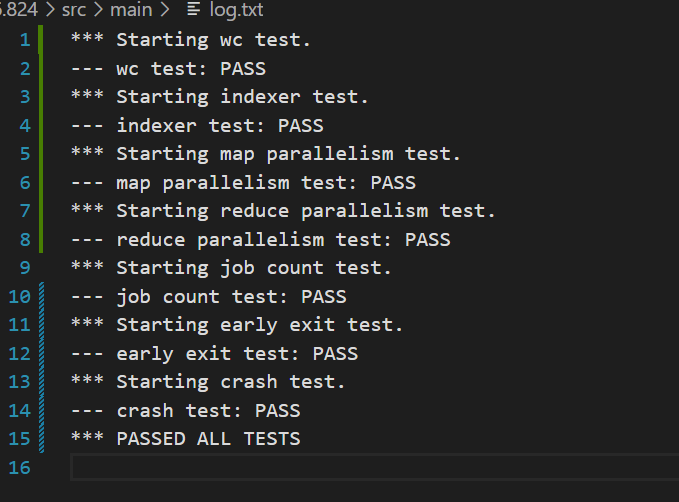
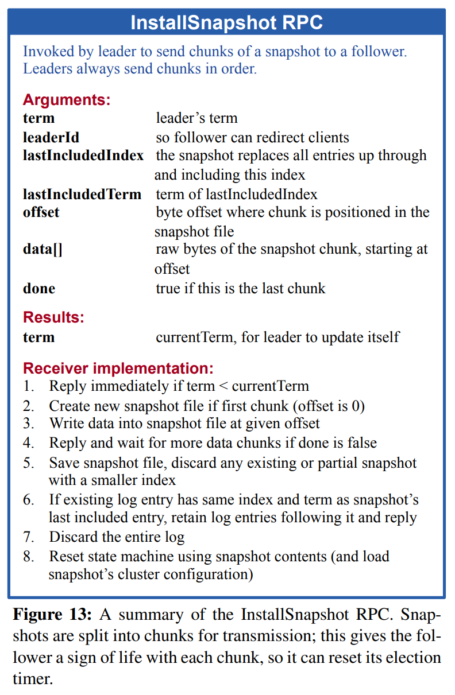
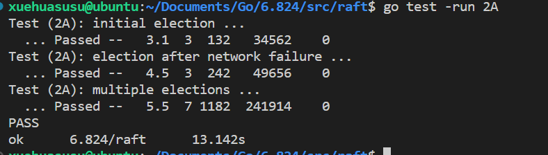

# 前言

写这个文档有两个目的，一个是为了捋思路，真的挺复杂，有时候将想法写下来会更好思考，而且有一种鼓舞的力量；其次是为了给各位面试官大人审阅，当然也给自己看，避免以后问到：这个项目有什么难点？结果自己全忘了

代码位置在私人仓库，这里只有实现的心得，因为课程说过不能分享代码，当然我自己也没有去找过代码，包括实现思路也从没去打听过，一切都只参考以下列出的资料。

# 参考资料

计划表 [ 6.824 Schedule: Spring 2021 (mit.edu)](http://nil.csail.mit.edu/6.824/2021/schedule.html) 

Go学习：[Go 语言之旅 (go-zh.org)](https://tour.go-zh.org/welcome/1) 

资源： [chaozh/MIT-6.824: Basic Sources for MIT 6.824 Distributed Systems Class (github.com)](https://github.com/chaozh/MIT-6.824) 

[MIT 6.824 2021 分布式系统 [中英文字幕\]_哔哩哔哩_bilibili](https://www.bilibili.com/video/BV16f4y1z7kn/) 

中文文档仅供参考，翻译不好，重点地方**需要看[原文](http://nil.csail.mit.edu/6.824/2021/schedule.html)**，按照学习顺序添加

[mapreduce论文翻译 - 知乎 (zhihu.com)](https://zhuanlan.zhihu.com/p/141657364) 

 [Google File System](https://www.cnblogs.com/zzjhn/p/3834729.html) 

 [The Design of a Practical System for Fault-Tolerant VirtualMachines ](https://zhuanlan.zhihu.com/p/539874472)  

Raft-Extended没找到合适的翻译  [这篇文章](https://blog.csdn.net/Hedon954/article/details/119186225) 篡改了原文，有些地方误导性很大


# mapreduce

学了两天Go教程，感觉Go在很多方面比C++要便利，尤其是学到管道<-和Go程的时候，它能很方便的进行Go之间的通信，虽然c++

也有管道和线程，但是Go只需一个关键字即可创建，Go的指针和引用我学的不是很明白，使用的时候全靠编辑器提示，它的指针语法似乎和C++差别挺大的，不过并没有颠覆我印象中的指针的定义，能用就行。

除此之外还有关于RPC远端调用，基本流程是服务端注册对象方法，客户端拨号连接，然后就可以直接调用了。

学的不深，希望不会对lab的实现产生太大负面影响。

## mapreduce1.0

worker包含map和reduce两阶段，均是自己主动调用服务器获取任务，当且仅当map完成，才会进行reduce阶段。

难点：设计通信协议，设计worker和master交互的协议很头疼，最后是放弃设计协议，先写逻辑，实际通信要用到什么字段就添加什么字段，这种操作可能不规范，但是确实是迈出第一步的好方法。

具体设计：

master保存map和reduce状态，然后map请求任务并将计算结果保存在本地，并通知master，reduce从master获取中间文件位置，(这里还没有实现用rpc调用获取map结果) 计算保存在临时文件，master收到reduce完成的通知后会关闭程序

reduce的问题很大：如何获取全部中间文件并对中间结果排序，论文就是很简单的说master将任务分配给reduce，并告诉reduce从哪一台机器取数据，然后。。。，然后实现的时候发现一个reduce取到的是一部分数据，如果一个reduce取得全部数据并且排序的话，再进行二次分发？那岂不是还要再设置一个reduce分配器？还有最终结果的整合，也是一样的情形。如果把这些任务交给master的话，似乎又和论文不符，论文中明确说了中间结果在map机器上，由reduce worker主动取获取。

## mapreduce2.0

再读论文发现漏了一个关键点，map输出文件不是一个单一的文件，而是很多个，对key使用hash得到中间文件的命名，那么这就合理了，可以保证同一个key值不会出现在第二个文件里面，那么在1.0的基础改：

map将key通过ihash计算值，再%NReduce（直到这一步我才明白ihash是做什么的），得到输出文件名，保存在本地磁盘，通知master，需要发送的消息应该包含所有输出文件的位置，直接用map\<bool\>传递消息，（可以实现一个bitmap优化，但是我想先实现一个无bug版的，后期考虑优化），服务器应该累计每一个reduce应当获取的文件所在机器和路径，等map执行完毕，master通知reduce启动，然后根据map的结果给每个reduce worker分配任务，其实还是worker主动请求，如果有未完成的任务，就分配给worker

我的分配策略是master只告诉map文件位置，而不是由master直接给数据，需要map自己去找，假设我有GFS的场景，虽然实际上我只有一台机器。(这让我想起了论文中说给map分配的数据大小一般是16或64M，而GFS文件系统的chunk刚好默认是64M。)然后map保存的中间文件在map主机，reduce通过rpc得到数据，然后进行工作，最后产生临时文件，通知master，如果没有重复的话就改名，否则丢弃。

问题总是很多，新出现的问题是使用gob压缩文件内容时，gob编码解码的问题：

写入文件后就读不出来了

```cpp
for ... {
    ofile := [应该写入的文件]
    enc := labgob.NewEncoder(ofile) // 编码器绑定文件
	enc.Encode(&kva[i])       // 编码并且写入
}
```

```cpp
	repy, err := ioutil.ReadAll(file)
	fmt.Print(len(repy), "\n") // 4521502 ，说明数据存在
	if err != nil {
		log.Fatalf("cannot read %v", filename)
		return err
	}
	r := bytes.NewBuffer(repy)
	d := labgob.NewDecoder(r)
	var intermediate []KeyValue

	for {
		var kv KeyValue
		err := d.Decode(&kv)
		if err == io.EOF {
			break
		} else if err != nil {
			log.Fatalf("cannot decode data: %v", err)
			return err
		}
		fmt.Print(kv, "\n") // 能输出一个kv，但只能输出一个，很难评价，我直接气晕
		intermediate = append(intermediate, kv)
	}
```

读取操作只能输出一对kv，然后就是`cannot decode data: gob: duplicate type received` 直接百度找不到答案，可能需要对gob有一定了解才行(而我只想傻瓜式调用)

## mapreduce3.0

经过三四个小时的排查，最终发现是因为编码时追加写模式导致的编码错误。太恶心了，发生错误是在解码阶段，一直以为是解码时参数设置不正确之类的缘故，写test的时候也没关心循环外创建文件还是在循环内的区别，直到把所有可能都想了一遍，只能说是被狠狠的恶心到了。

那么解决思路就是存下每个打开文件的指针，如果当前需要写入的文件已经被打开过，那么就使用上一次打开过的，否则就打开，不过我选择更加省事的操作，一次性打开所有文件，需要的时候直接获取，这样操作对效率应该没有什么影响，从两方面考虑，这些文件从打开后就不能关闭，直到任务结束，所以动态打开和一次性打开消耗的内存一致，而且一次性打开时间上也会快些。

于是，终于得到了一个能输出的分布式框架（bushi)


接下来是容错的计划，论文上提过我们的程序必须容忍错误，比如map就算执行完毕，只要宕机那么它的任务需要重新执行，reduce宕机则不用，因为reduce执行完毕后，存储在全局文件系统。还有当个别任务迟迟等不到回复的时候，需要重新分配任务，此时不管是因为worker主机宕机，还是执行速度慢，都重新分配。论文似乎没有说到有心跳检测机制，那我也不实现了，所有回复慢的一律再分配。


改着改着，突然又跑不了了，而且出现了贼抽象的bug

```
// mapworker
reply.Inputfiles = ""
reply.Taskid = -1
fmt.Print(args.Port, " 1111111 ", reply, "\n")
err := call("Coordinator.GetMapTask", &args, &reply)
fmt.Print(args.Port, " 2222222 ", reply, "\n")

// GetMapTask func
	c.mutex.Lock()
	defer c.mutex.Unlock()
	reply.NReduce = c.nreduce
	for i, filename := range c.filename {
		if c.mapTask[i] == false { // 未分配的任务
			fmt.Println("map分配 ", i, ' ', filename)
			c.mapTask[i] = true
			reply.Inputfiles = filename
			reply.Taskid = i
			return nil
		}
	}
```

按理说，reply作为传出参数，要么全被改，要么不修改，它在GetMapTask里面只被修改了一半....但是GetMapTask并没有出现内部崩溃的现象（err==nil），哎我真服了，这都是什么奇葩，具体就是reply传回了文件名，但是没有传回Taskid，通过代码可以看到，我首先清空了Inputfiles和Taskid=-1，紧接着直接call协调器，然后协调器会给Inputfiles和Taskid赋值，离谱的是当filename ==  "pg-being_ernest.txt" && i == 0的时候，就出现这样的输出：

```
32833 1111111 {false -1  10}
32833 2222222 {false -1 pg-being_ernest.txt 10}
```

可以看到Taskid未被赋值为0，但Inputfiles被赋值了，难道是0不配？多测试几组，只要是遍历到了0，就会出这个错误，无一例外：

```
37079 1111111 {false -1  0}
37079 2222222 {false 2 pg-frankenstein.txt 10}
maptask sussess 2
37079 1111111 {false -1  10}
37079 2222222 {false 4 pg-huckleberry_finn.txt 10}
maptask sussess 4
37079 1111111 {false -1  10}
37079 2222222 {false 6 pg-sherlock_holmes.txt 10}
maptask sussess 6
37079 1111111 {false -1  10}
37079 2222222 {false 3 pg-grimm.txt 10}
maptask sussess 3
37079 1111111 {false -1  10}
37079 2222222 {false 5 pg-metamorphosis.txt 10}
maptask sussess 5
37079 1111111 {false -1  10}
37079 2222222 {false -1 pg-being_ernest.txt 10} // 注意就是这一行出错
```

之前测试必有0号任务，但是一点问题没有，这究竟是为什么：首先0号任务是一定被分配了的，因为fmt.Println("map分配 ", i, ' ', filename)被执行了，Inputfiles也被赋值了，那么Taskid是为什么没有被赋值，因为后续任务的报告都是依靠Taskid，这里对不上账，后面几乎全错了。

进一步输出发现Taskid被赋值了，但是call完传回去又变成-1了，真是开眼了，reply不是指针吗，如果Taskid无法传递那么Inputfiles也不应该有值才对，凭什么！！！算了，不解决了，我直接把下标设置为从1开始。


好好好，这个bug完美解决，虽然还是不知道为什么会成为bug。

## mapreduce4.0

来到4.0，本来3.0版本就该解决容错机制的，但是那个bug查了好几个小时写吐了，那么就把容错机制甩到4.0来好了。

3.0采用的策略是只要worker请求了，master就分配，但是从不主动分配任务，worker端开始执行reduce后就不会再请求map任务，这样导致的问题：如果reduce阶段开始了，运行到一半，map主机宕机了，那么woker也不会再向master反馈了。

我采用比较"懒"的做法：

**第一种情况：**

master设置一个通信方法，用于验证worker是否还能用。每分配出一个任务，就启动定时器1绑定任务，定时器1结束之前如果没有收到响应，那么启动通信验证，如果worker不在了就重新分配，否则就重新定时，如果三次后还没有完成任务，那么就当它不在了，重新分配。这里的情况比较单一，等待worker请求就好，如果不想分配的话就先阻塞，等master判断可以分配了就分配任务，如果完成了当前阶段的任务，就既不分配同时也放掉阻塞。

完成以上大概需要添加任务结构体，分为maptask和reducetask，要存储执行task的worker的通信地址，任务id等，还有定时器。

除此之外，还需要解决**reduce阶段，map连接不上的情况：**

reduce callMap会尝试连接三次，三次失败之后，暂时不通知master，先查看输入文件列表是否有其它可用文件，如果没有，那就通知master，否则使用新的可用文件，master必须让原先map得到的任务重新执行，并且停止reduce任务分配，防止出现大量reduce失效的情况，正在运行的reduce如果没出问题的话，就不受影响，不过大概率会出问题，除非reduce赶在map失效前读取到了数据。

失败的reduce会选择继续执行，不过我觉得相比于复杂的容错机制，重新执行并不会造成太大的额外开销。如果有reduce第二次报告错误，那么会直接更新reduce输入文件列表。

完成这些动作需要在reduce callMap失败之后，callMaster，master修改文件列表，并返回当前正确的文件地址，使用maptask记录id就不用在第二次报告失效的时候重新执行了。还有在master收到失效消息的时候，要先callMap进行一次确认，如果可以call，那么就直接返回了，不用进行其它操作。

思路清晰了，开始动手开始动手开始动手开始动手开始动手开始动手开始动手



好好好，完结撒花！！！


最终的rpc通信协议：

```Go
type MapArgs struct {
	Addr       string // worker地址
	Port       int    // worker端口
	Taskid     int
	Tasktype   string
	Outputfile map[int]string
}

type MapReply struct {
	Taskid     int
	Inputfiles string
	NReduce    int
	Timeout    time.Duration
}

type ReduceArgs MapArgs

type ReduceReply struct {
	Taskid     int
	Inputfiles []string
	Outputfile string
	Timeout    time.Duration
}
```

master字段

```Go
type Coordinator struct {
	// Your definitions here.
	idx     int
	nreduce int

	filename map[int]string

	// 已分配的任务为true，未分配的任务为false
	mapTask    map[int]bool
	reduceTask map[int]bool

	// 已完成的任务为 结果地址，未完成的任务为 ""
	// taskid -> fileaddr
	achieveMapTask    map[int]string
	achieveReduceTask map[int]bool

	// 用于判断是否完成任务
	achievemap    chan bool
	achievereduce chan bool

	// 互斥锁
	mutex sync.Mutex
	// 条件变量
	cond *sync.Cond

	// 中间文件id对文件地址的映射 int -> []string , 文件id是根据nreduce分配的
	midfile map[int][]string

	// 完成map
	achievmap     bool
	achievmapchan chan bool
	// 完成所有
	achieveall     bool
	achieveallchan chan bool

	// 为每一个Task设置超时器
	maptimer    map[int]*timer.Timer
	reducetimer map[int]*timer.Timer
	timeout     time.Duration
}
```

worker

```
type Maphost struct {
	Addr string
	Port int
}
```

4.0 感想：

刚开始最难的部分是制定通信协议，可能万事开头难，刚上手根本想不到后面该干什么，除非有足够经验，否则过早的制定通信会给后面带来很大的麻烦，最好的办法是不要一开始写死，留一些扩展的余地，缺少什么字段就往协议里面加，有多余的就减，不要一开始就苦思协议，这样意义不大，除非写多了经验丰富，可能就是所谓架构师吧。

第二个难点是debug，这一阶段实现的是基础功能，就是分布式下能正常运行就可以了，但是这种多线程系统要debug真的很麻烦，多线程下的gdb调试只会c++的，go的还没用过，原理应该一致，但我就是头铁，只使用fmt调试，效率不太高，不过想想使用gdb的话也需要各种手动切换线程查看堆栈变量信息，大佬操作，我不弄可能还是正确的选择（狡辩）。关于那个Taskid=0传回原值的bug至今也不知道是什么原因，之后也遇到过一次远端调用值不改变的bug，但是那是由于我通信字段没有首字母大写，Go里面有一个导出变量的概念，想要访问不属于本文件的变量，必须首字母大写(我没有深入了解，可能有误)，我回过头看Taskid当时应该是已经是大写了，不存在这个问题才对，而且bug在于只有等于0的时候才无法改变值，其余的数字均正常赋值。

第三个难点是容错机制的实现，论文提到：map失效必须重新执行，reduce不用，超时的任务选择重新分配

寥寥三句话，花了我好几个小时实现，主要还是思路想半天，还有debug：超时使用定时器定期发布任务，仅仅是发布，只有等worker过来取的时候我才分配，master会根据当前进度选择不同的心跳时间，心跳时间一到，worker就会与master相连，此时如果有任务就直接分配，没有就下个心跳时间再来。如果map挂了，而此时又是reduce阶段的话，会阻塞所有reduce分配，直到map完成为止。


# raft

通过对lab1的实现，初步了解了分布式系统，和前几篇行为单一的论文不一样，raft论文描述的东西很多，很复杂，花了三四天才看完论文，每次都看着看着就没心思看下去了，一直在拖延，中文文档翻译的很一般，感觉像机翻，硬着头皮看完原文。感觉面对难以弄懂的知识，很有效的一个手段是反复学习，而不是从头懂到尾（过于理想的状态），初期看raft根本看不下去，多看几遍之后感觉很有意思。

raft的复杂性远高于mapreduce，lab2被分为abcd四个小lab。 论文用一张表简要说明了大致的实现方向：


一些要点：

1. 如何定义日志的“最新”，如果lastTerm不同，则数字越大的越新，如果lastTerm相同，则索引（日志长度）越大的越新，candidate不能投票给比自己“旧”的。

2. leader不能提交往期的日志，只能通过提交当前任期日志，间接提交往期的日志。

3. 安全性通过以上两点保证，但不完全只有以上两点



## raft 2a

2a主要是leader选举方面的实现

万事开头难放在任何时候都是这样的，拿到代码框架完全不知道从哪里入手。。。磨蹭半天根据图2写了一些结构体，做了下初始化。

虽然2a只检查领导选举，但是又不能只写选举，选举机制建立在日志的新旧程度上，那么要先把日志相关的写了，这个过程遇到很烦人的问题，日志这个东西不管在哪里都掺和了一脚，导致只要有一个地方出现纰漏都要改很多个相似的代码，于是决定把日志抽象成类，给它定义一些管理方法。

```go
type Entry struct {
	Term    int
	Command interface{}
}

type Log struct {
	Entries []Entry
	index0  int // 日志起始下标，压缩日志时使用，默认为0
}

func (log *Log) endIndex() int {
	return log.index0 + len(log.Entries)
}

func (log *Log) beginIndex() int {
	return log.index0
}

func (log *Log) lastTerm() int {
	if len(log.Entries) == 0 {
		return -1
	}
	return log.Entries[len(log.Entries)-1].Term
}

func (log *Log) append(entry Entry) {
	log.Entries = append(log.Entries, entry)
}

func (log *Log) get(index int) Entry {
	return log.Entries[index-log.index0]
}

```

目前来说就这些，随着功能的增加还会不断完善，抽象出来后主体代码简洁多了



中间出了一个bug，产生原因是reply参数被多个线程共享了，一开始没有注意，gob的警告一直被我忽略(一直以为是其它地方造成的，在寻找逻辑bug)，直到我重视gob警告说对象可能无效，才发现这个问题。所以warning不是没有道理的(捂脸)。


## raft 2b

2b主要实现日志的复制，Start 和 AppendEntries，大部分的代码2a已经实现了，在这个基础上改一改就能通过（希望如此）

日志索引从0开始的话会出现下标为-1之类的边界情况，特判起来很麻烦，不仅需要考虑下限还要考虑上限，容易引起bug，从1开始比较好，此时就体现出2a中抽象出log的优势了，我只要改一下初始化和个别方法就可以了。

同样的，任期也改为从1开始，可以避免很多麻烦。

debug:

1.日志无限输出，陷入了死循环，排查后发现是**死锁**，是ticker函数占用锁，而负责发送心跳的函数也申请了锁导致的问题，解决办法是冗余函数代码，对有锁和无锁分别写一个实现，并加上后缀L进行区别，有L表示i调用方有锁，无需申请，没有L则需要主动申请。这个bug2a的时候应该就存在，但是没有测试出来。

题外话：现在打日志是越来越熟练了，把可能要的信息尽可能详细的全部打印出来，然后使用搜索工具检索关键字就好了，日志信息最好包含时间戳，对象唯一标识，和一定的提示信息，现在想想以前的调试真像原始人，打日志一定不要偷懒，日志信息越少调试越困难。了解到更高级的方法是对日志进行解析，分颜色显示，甚至是分列显示，不过目前还没做到这步。

2.有一个问题是follower在复制完上一条日志前，又收到了新的同步，导致一直在同步，多出了很多rpc请求，这里的策略的是失败立即重试，可能是这个策略的缘故，那么我就改为失败后等待下一个心跳同步。

3.八个点过了六个，失败的测试点：cmd 100 missing in [1 101 101 104 104] ` 猜测是复制日志的时候有细节没处理得当。检查了一下发现日志全部都完整的提交了，主从都提交了完整的日志上去。有点奇怪，我得看看测试程序到底要求我干什么

